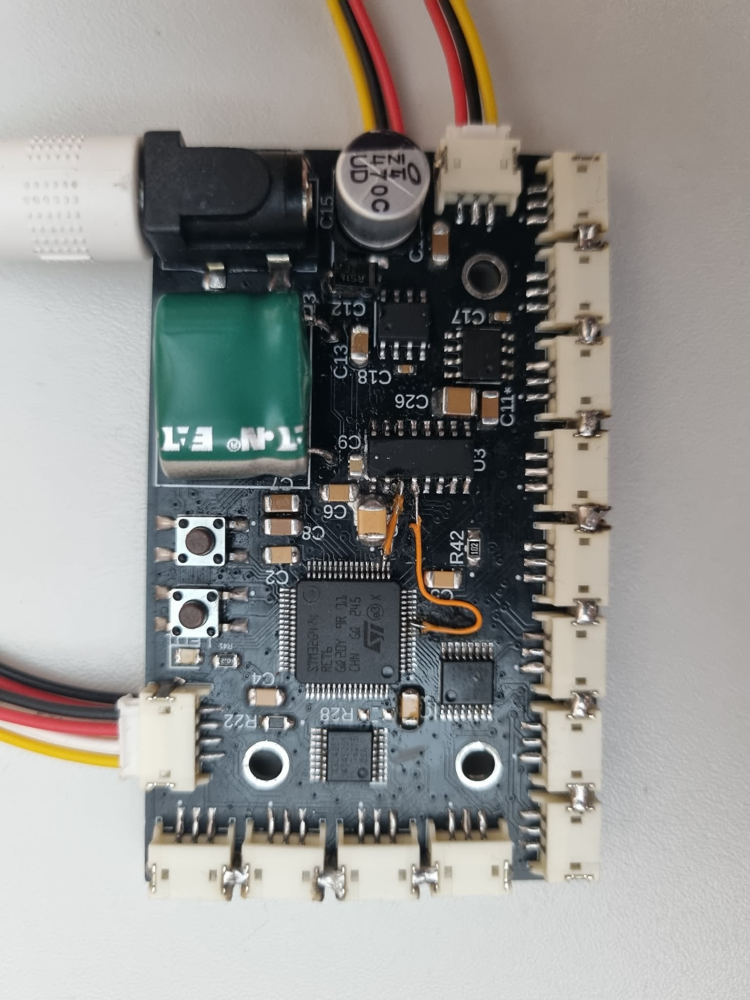
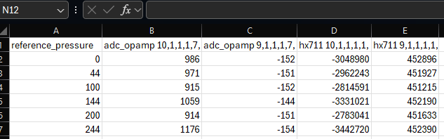
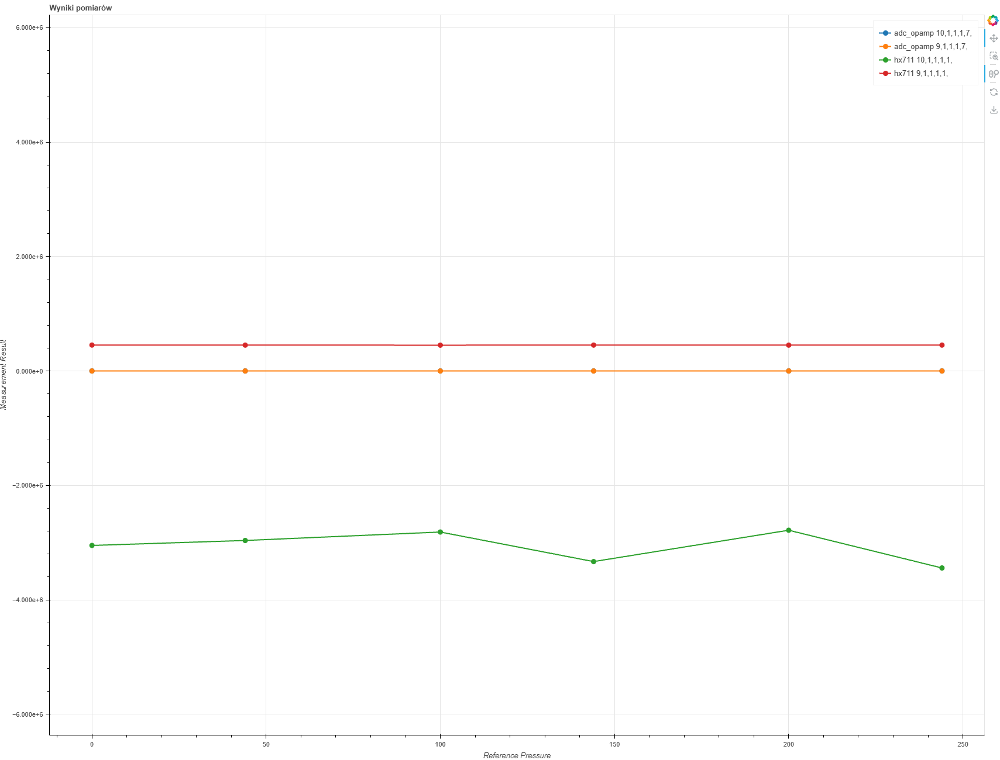

# Strain Gauge Sensor

Pomiar ciśnienia w butlach kompozytowych na podstawie analizy odkształceń zbiornika.  

Projekt magisterski **Konrada Kobielus**.

Celem projektu było stworzenie i zbadanie czujnika ciśnienia w butlach kompozytowych metodą nieinwazyjną. Rozwiązaniem problemu było wykorzystanie czujników odkształceń – tensometrów. Zbadane odkształcenia zestawia się z ciśnieniem referencyjnym zmierzonym manometrem. Na tej podstawie wyznacza się charakterystykę, która pozwala jednoznacznie określić ciśnienie panujące w butli.

---

## 1. Sprzęt i PCB

W ramach projektu została zaprojektowana i wykonana płytka PCB z mostkiem Wheatstone’a, do którego przez multiplekser podłączane są tensometry. Wyniki z układu odczytywane są za pomocą jednego z trzech przygotowanych interfejsów (Tab. 1).



Komunikacja z płytką odbywa się poprzez interfejs **USART** z prędkością 115200 baud. Użytkownik przesyła komendy w formacie:

```c
cmd uint8_t command_id uint8_t param_1 ... uint8_t param_6
```

Kolejne parametry są interpretowane indywidualnie przez każdą komendę. Dla komend pomiarowych parametry oznaczają wartości opisane w Tab. 2. 

Uwaga! Wyjścia multipleksera indeksowane są od 1 do 8. Dla gałezi bridge out 1 dostępne są dwa multipleksery a zatem 16 połączeń.

Rezultaty wypisywane są  przez interfejs USART.

---

## 2. Analiza danych

Zebrane dane należy umieścić w folderze `logs` jako plik `dowolna_nazwa.txt`. Następnie w folderze `python` uruchomić skrypt:

```bash
python parse_to_csv.py
```

Efektem działania skryptu będzie:  

- Plik `.csv` w folderze `csv`, przedstawiające dane w pliku typu excel


- Plik `.html` w folderze `charts`, przedstawiający dane na wykresie


---

## 3. Propozycje dla nowego PCB

- Połączyć dwie linie sygnałowe (**DOUT**, **SCK**) dla układów HX711.
- Rezystory i zworki mogą na siebie nachodzić, aby ograniczyć zajmowaną przestrzeń PCB.
- Część złączek powinna być podpięta do kilku multiplekserów, aby ułatwić przełączanie.
- Dodać diodę zabezpieczającą przed odwrotną polaryzacją napięcia wejściowego.
- Poprawić footprint złącza DC – obecnie **plus zwarty z minusem (prawy dolny pin)**.
- Można zwiększyć odstępy między konektorami tensometrów.
- Można podłączyć złącza **B** układów HX711 do wolnych pinów multipleksera interfejsów.
- Obecna konfiguracja ADC nie pozwala na pomiary różnicowe – błędna konfiguracja w przełącznicy ADC. Można wykorzystać oba kanały, ponieważ jest dużo wolnego miejsca w multiplekserze interfejsów.
- Prawdopodobnie potrzebny będzie mikrokontroler z większą liczbą pinów.
- Dodać układ **soft start** dla **superkondensatora (SUPER CAP)**.
- Dodać **testpointy** na liniach podłączonych do interfejsów.
- Opcjonalnie dodać czwarte mocowanie na śrubę.
- Dodać interfejs do odczytywania referencyjnego ciśnienia z manometru.
- Wstępna przetwornica napięcia wejściowego.
- Zewnętrzne układy **op-amp**.
- Zmienić złacze zasilające na standardowe wymiary


## 4. Typy interfejsów

| ID | Interfejs       |
|----|----------------|
| 0  | HX711           |
| 1  | ADC_OPAMP       |
| 2  | ADC             |

tab 1.

---

## 5. Parametry komend

| Parametr      |
|---------------|
| INTERFACE     |
| BRIDGE_1      |
| BRIDGE_2      |
| BRIDGE_3      |
| BRIDGE_4      |
| EXTRA_PARAM   |

tab 2.

---

## 6. Lista komend

| ID | Komenda                           |
|----|----------------------------------|
| 0  | SCHEDULE_MEASUREMENT              |
| 1  | EXECUTE_MEASUREMENTS              |
| 2  | SINGLE_MEASUREMENT                |
| 3  | REMOVE_MEASUREMENT                |
| 4  | REMOVE_SCHEDULED_MEASUREMENTS    |
| 5  | SERIALIZE_COMMANDS                |
| 6  | SAVE_COMMAND_TO_FLASH *(private)* |
| 7  | RESTORE_SERIALIZED_COMMANDS       |
| 8  | ERASE_FLASH                       |
| 9  | PRINT_SCHEDULED_COMMANDS          |

tab 3. 

## 7. Rezystory dla poszczególnych układów IC

### IC 1

| Wyjście | Rezystory | Wartość |
|---------|-----------|--------|
| Y0      | R16       | 402R   |
| Y1      | R15       | 1R     |
| Y2      | R13 + R14 | 8K     |
| Y3      | R17 + R18 | 804R   |
| Y4      | R10 + R12 | 20R    |
| Y5      | R8  + R9  | 2K     |
| Y6      | R11       | 10R    |
| Y7      | R7        | 5R     |

### IC 3

| Wyjście | Rezystory | Wartość |
|---------|-----------|--------|
| Y0      | R21       | 120R   |
| Y3      | R22       | 348R   |

### IC 4

| Wyjście | Rezystory | Wartość |
|---------|-----------|--------|
| Y0      | R29       | 120R   |
| Y3      | R30       | 348R   |

### IC 7

| Wyjście | Rezystory | Wartość |
|---------|-----------|--------|
| Y0      | R31 + S9  | 120R   |
| Y3      | R32 + S10 | 348R   |

### IC 9

| Wyjście | Rezystory | Wartość |
|---------|-----------|--------|
| Y0      | R35 + S11 | 120R   |
| Y3      | R36 + S12 | 348R   |